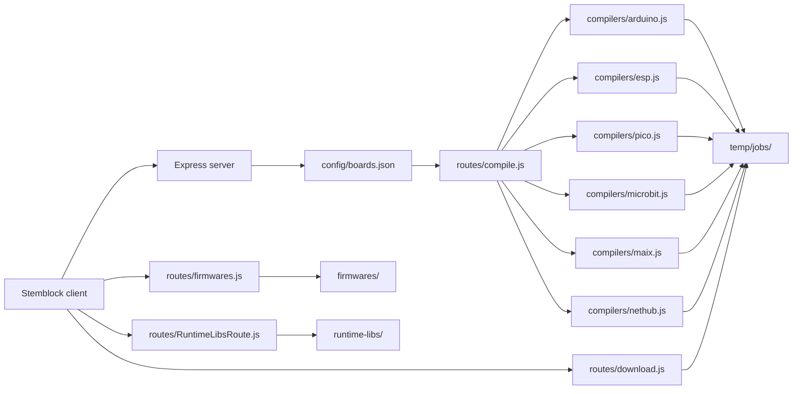

# Architecture

## Metadata

- Last Updated: 2026-05-24
- Updated By: Codex Agent
- Change Summary: Updated Nethub IR runtime package upload target

## Stack
- Runtime: Node.js `>=18`, CommonJS.
- Server: Express 4.
- Middleware: `helmet`, `cors`, `morgan`, `express-rate-limit`, `dotenv`.
- Toolchains:
  - Arduino CLI for AVR, ESP32/ESP8266, and Pico.
  - PlatformIO CLI (`pio`) for Micro:bit and K210/Maix.
  - `mpy-cross` for Nethub MicroPython `.mpy` compilation.

## High-Level Flow

## Server Entrypoint
- `server.js` creates the Express app.
- CORS allowlist includes Stemblock production domains and `http://127.0.0.1:8601`.
- JSON body limit is `5mb`.
- `GET /health` is a simple readiness endpoint.
- `POST /compile` is rate-limited to 100 requests per 15 minutes per client.
- Routes mounted:
  - `/compile`
  - `/download`
  - `/firmwares`
  - `/runtime-libs`

## Board Routing
- `config/boards.json` maps client board IDs to:
  - `type`: compiler family.
  - `fqbn`: Arduino CLI fully qualified board name when applicable.
  - `variant`: PlatformIO variant when applicable.
  - `output`: expected artifact type.
- `routes/compile.js` switches on `boardConfig.type`.

## Compiler Modules
- `compilers/arduino.js`
  - Writes `sketch/sketch.ino`.
  - Runs Arduino CLI via `execFile`.
  - Uses hard-coded `/var/www/html/stemblock-link/toolchains/arduino-cli/...` paths.
  - Expected output: `.hex`.
- `compilers/esp.js`
  - Writes `sketch/sketch.ino`.
  - Runs Arduino CLI with `--build-path`, `--export-binaries`, and `--warnings none`.
  - Returns app `.ino.bin`, bootloader `.bin`, partitions `.bin`, and `flash_args`.
  - Uses hard-coded production Arduino CLI paths.
- `compilers/pico.js`
  - Writes Arduino sketch and uses repo-relative Arduino CLI paths.
  - Expected output: `.uf2`.
- `compilers/microbit.js`
  - Generates a temporary PlatformIO project.
  - Uses `nordicnrf51`, `bbcmicrobit` or `bbcmicrobit_v2`, Arduino framework.
  - Expected output: `.hex`.
- `compilers/maix.js`
  - Generates a temporary PlatformIO project.
  - Maps variants to Sipeed K210 boards.
  - Expected output: `.bin`.
- `compilers/nethub.js`
  - Uses `MPY_CROSS` env var or repo-relative default `toolchains/micropython/mpy-cross/build/mpy-cross`.
  - Writes `fs/main.py`.
  - Copies selected runtime libraries and package directories from `runtime-libs/`.
  - Adds `runtime-libs/ir_rx/` only when generated code references `ir_rx` or `NEC_8`, and maps it to `/lib/ir_rx/` on the ESP32 filesystem.
  - Normalizes old `import ir_rx.nec` / `ir_rx.nec.NEC_8(...)` code to direct `from ir_rx.nec import NEC_8` / `NEC_8(...)` usage.
  - Verifies `runtime-libs/ir_rx/nec.py` exists, defines receiver class `NEC_8`, and does not depend on transmitter package `ir_tx`.
  - Prepends an `ir_rx` filesystem bootstrap to `main.py` for dependency-based IR code so clients that upload only `main.py` still create `/lib/ir_rx/__init__.py`, `/lib/ir_rx/nec.py`, `/lib/ir_rx/print_error.py`, and avoid `ImportError`.
  - Compiles libraries sequentially, then `main.py`, to `.mpy`.
  - Returns Nethub upload metadata and ordered runtime library artifact paths plus target ESP32 filesystem paths for client upload.

## Routes and API Shape

| Route | Method | Purpose |
| --- | --- | --- |
| `/health` | GET | Service health JSON. |
| `/compile` | POST | Compile or prepare code for a board. |
| `/download/:jobId/:filename` or nested fs path | GET | Download a named generated artifact. |
| `/download/:jobId` | GET | Find and download first `.hex`, `.bin`, or `.uf2` in a job. |
| `/download/desktop/files` | GET | List desktop `.exe` builds. |
| `/download/desktop/download/:filename` | GET | Download named desktop build. |
| `/download/desktop` | GET | Download newest desktop `.exe`. |
| `/firmwares` | GET | List bundled firmware by category. |
| `/firmwares/nethub/manifest` | GET | Return Nethub firmware candidates and upload metadata. |
| `/firmwares/:category/:filename` | GET | Stream bundled firmware. |
| `/runtime-libs` | GET | List compatible runtime `.py` libraries. |
| `/runtime-libs/:filename` and nested package paths | GET | Stream a runtime library. |

## Data and Storage
- No database is used.
- Temporary generated files are written under `temp/jobs/`; this directory is created on demand and ignored by the clean script.
- Bundled static assets:
  - `firmwares/arduino/*.hex`
  - `firmwares/microPython/*.bin`
  - `runtime-libs/*.py`, selected `.mpy`, and `runtime-libs/ir_rx/` uploaded to `/lib/ir_rx/` for Nethub IR
  - `downloads/desktop/*.exe` when present locally/deployed.

## Security and Error Handling
- Helmet enabled globally.
- CORS is restricted for app routes; firmware/runtime routes also set permissive `Access-Control-Allow-Origin: *` headers for fetch/WebSerial usage.
- Compile route validates `board` and `code`, rejects unsupported board IDs, and returns 500 JSON on compiler failures.
- Download route validates job IDs and filenames with regex.
- Runtime library route validates flat safe filenames and prevents path traversal.
- Firmware route checks `startsWith(BASE)`, but should use `path.basename`/`path.relative` for stronger traversal protection. Needs verification before changing due API compatibility.

## Needs Verification
- Whether `multer` is unused dependency or planned upload support.
- Whether `case "sylvie"` in `routes/compile.js` is reachable, since current config sets `sylvie.type` to `arduino`.
- Whether `compilers/esp.js` supports ESP8266 correctly, because it always expects ESP-style bootloader, partitions, and `flash_args` files.
